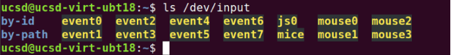

# VMware Player Installation

Virtual machines (VMs) are essentially computers running on computers &mdash; you can simulate a different operating system than the one native to your computer.

## Prerequisites

* Unzipping software (7Zip, Winrar) 

* Download the VMware Player installer (depending on your machine's OS)

* Download the Ubuntu VM image &mdash; make sure you have enough space on your disk   (~40 GB zipped, ~50 GB unzipped)

* Minimum 8 GB system RAM on host machine (by default the VM uses 5 GB)
  * If your system has at least 16 GB of RAM, enter the VM settings for the image and increase the RAM alloted to 8 GB; the VM must not be running to do so

## VMware setup

* Open VMware Player and select *Open a Virtual Machine*
  * You will be prompted to select an image to be added &mdash; select the image you downloaded with the *.vmx*
 extension

* It should now appear in the list on the left of the VMware Player window &mdash; single-click the image and select *Edit Virtual Machine Settings*

* Here you can edit the memory settings and any other settings required to run the VM

* If you experience an error with respect to *Intel-VT* or *AMD-V*, disable the virualization engine in the *Processors* tab 


## Initial Boot up of VM

* If necessary, enable virtualization in your BIOS/UEFI

* When you are ready, start the virtual machine

* Login Credentials
  * User: ucsd
  * Password: UcsdStudent 

### Cutting and Pasting

* If cutting and pasting is not working from the host to the VM, open a terminal in the VM and run the following commands:

```
    sudo apt-get autoremove open-vm-tools
    sudo apt-get install open-vm-tools-desktop
    sudo reboot now
```
## Connecting Game Controller

Connecting a game controller is useful in order to control the car used in the simulations you will be running and other projects (these can include Playstation or Xbox controllers, or the Logitech controller likely included in your kit).

These should be connected using via a USB cable, Bluetooth, or a USB dongle.

When connecting a controller, the VM should ask if the input device will be connected to the host system or the virtual machine &mdash; connect it to the VM by selecting the name of the VM.

 


### Verify Controller connection

The controller will be identified as js0 (or js# if there are multiple joysticks connected to the system)

Run the following command in a VM terminal:

    ls /dev/input

If the controller is connected, it should appear as js0 in the terminal output.



To test the joystick controls, run in a terminal:

    sudo apt-get update
    sudo apt-get install -y jstest-gtk
    jstest /dev/input/js0


Then interact with the controller to see the values printed to the terminal change (analog inputs should change smoothly, while digital inputs like button presses change between on and off)

### Custom Controller 

If your controller is not behaving correctly, or you need to generate new controller mappings, you can generate custom controllers. 

See https://docs.donkeycar.com/parts/controllers/ for controller support; custom mapping is linked at the bottom of the page.

To setup a new controller or modify input mappings, you can use the Joystick Wizard (described here: https://docs.donkeycar.com/utility/donkey/#joystick-wizard)

The joystick wizard creates a custom controller named "my_joystick.py" in the *mycar* folder. To enable it, in the *myconfig.py* file, set ```CONTROLLER_TYPE="custom"``` 
    
To run the wizard, from a terminal in the PATH/TO/mycar directory, run 

    donkey createjs

To determine if the system can see the input device, jstest can be used. If it is not installed, run ``` sudo apt install joystick```

## DonkeyCar AI Framework

This software allows you to train an AI model to run simulated or even physical vehicles using computer vision (either virtually or in reality).

### Launching the Simulator

Using the file explorer in the VM, navigate to ```~/projects/DonkeySimLinux/``` and execute the file ```donkey_sim.x86_64```


### Track Names

Depending on the track to be raced on, you need to change the track to train on; those include:

* donkey-circuit-launch-track-v0
* donkey-warren-track-v0
* donkey-mountain-track-v0

### Customizing Virtual Car

From a terminal, run ```atom myconfig.py``` from the ```~/projects/d4_sim/``` directory.

Within the ```myconfig.py``` file, change the:

* car_name
* racer_name
* your country location (under "country")
* a fun fact (under "bio")
* car color (in the dictionary entry for "body_rgb")


#### Example Config File
```
# 04Jan22
# UCSD mods to make easier for the UCSD students to use the Donkey-Sim
# the following uncommented lines where copied here from the body of myconfig.py below
DONKEY_GYM = True
# DONKEY_SIM_PATH = "remote"
DONKEY_SIM_PATH = "/home/ucsd/projects/DonkeySimLinux/donkey_sim.x86_64"
# DONKEY_GYM_ENV_NAME = "donkey-warren-track-v0"
DONKEY_GYM_ENV_NAME = “donkey-mountain-track-v0”
# UCSD yellow color in RGB = 255, 205, 0
# UCSD blue color in RGB = 0, 106, 150
GYM_CONF = { "body_style" : "car01", "body_rgb" : (255, 205, 0), "car_name" : "UCSD-148-YourName", "font_size" : 30} # body style(donkey|bare|car01) body rgb 0-255
GYM_CONF["racer_name"] = "UCSD-148-YourName"
GYM_CONF["country"] = "USA"
GYM_CONF["bio"] = "Something_about_you, ex: Made in Brazil"
#
# SIM_HOST = "donkey-sim.roboticist.dev"
 SIM_ARTIFICIAL_LATENCY = 0
SIM_HOST = "127.0.0.1"              # when racing on virtual-race-league use host "roboticists.dev"
# SIM_ARTIFICIAL_LATENCY = 30          # Use the value when you ping roboticists.dev. When racing on virtual-race league, use 0 (zero)

# When racing, to give the ai a boost, configure these values.
AI_LAUNCH_DURATION = 3            # the ai will output throttle for this many seconds
AI_LAUNCH_THROTTLE = 1            # the ai will output this throttle value
AI_LAUNCH_KEEP_ENABLED = True      # when False ( default) you will need to hit the AI_LAUNCH_ENABLE_BUTTON for each use. This is safest. When this True, is active on each trip into "local" ai mode.
#
# When using a joystick modify these specially USE_JOYSTICK_AS_DEFAULT = True
# JOYSTICK
# USE_JOYSTICK_AS_DEFAULT = True     #when starting the manage.py, when True, will not require a --js option to use the joystick
JOYSTICK_MAX_THROTTLE = 1.0         #this scalar is multiplied with the -1 to 1 throttle value to limit the maximum throttle. This can help if you drop the controller or just don't need the full speed available.
JOYSTICK_STEERING_SCALE = 0.8       #some people want a steering that is less sensitve. This scalar is multiplied with the steering -1 to 1. It can be negative to reverse dir.
AUTO_RECORD_ON_THROTTLE = True      #if true, we will record whenever throttle is not zero. if false, you must manually toggle recording with some other trigger. Usually circle button on joystick.
JOYSTICK_DEADZONE = 0.2             # when non zero, this is the smallest throttle before recording triggered.
# #Scale the output of the throttle of the ai pilot for all model types.
AI_THROTTLE_MULT = 1.0              # this multiplier will scale every throttle value for all output from NN models
#
```
### Get Latency from Remote Server

To get the latency between your computer and the server, ping it using the command 
```
  ping donkey-sim.roboticist.dev
```


Since this computer is on the same network as the server, the delay is much lower than 0.5 ms. When pinging the server within the US, you should expect about 20-60 ms.

Replace the value of ```SIM_ARTIFICIAL_LATENCY``` with the average ping delay (e.g. ```SIM_ARTIFICIAL_LATENCY=30```)

### Collecting Data

The AI model works via behavioral cloning. In order to collect data for it, we need to drive the car in the virtual environment.

Enter the donkey virtual environment with the command:
```
conda activate donkey
```
(donkey) should now appear at the beginning of the terminal prompt.


Enter the donkeycar directory
```
cd ~/projects/d4_sim
```

To drive the car in order to collect data, run
```
python manage.py drive
```


Open a web browser and go to ```http://localhost:8887 ```

#### Driving using Mouse and Keyboard

From the web address above, you can control the car using a virtual joystick

**To stop the DonkeyCar framework, use CTRL + C in the terminal**

#### Driving using a Gamepad

To use a physical joystick without using the web browser, edit this section in ```myconfig.py```.

```
# #JOYSTICK
# USE_JOYSTICK_AS_DEFAULT = False      #when starting the manage.py, when True, will not require a --js option to use the joystick
# JOYSTICK_MAX_THROTTLE = 1         #this scalar is multiplied with the -1 to 1 throttle value to limit the maximum throttle. This can help if you drop the controller or just don't need the full speed available.
# JOYSTICK_STEERING_SCALE = 1       #some people want a steering that is less sensitve. This scalar is multiplied with the steering -1 to 1. It can be negative to reverse dir.
#AUTO_RECORD_ON_THROTTLE = True      #if true, we will record whenever throttle is not zero. if false, you must manually toggle recording with some other trigger. Usually circle button on joystick.
# CONTROLLER_TYPE = 'ps4'            #(ps3|ps4|xbox|pigpio_rc|nimbus|wiiu|F710|rc3|MM1|custom) custom will run the my_joystick.py controller written by the `donkey createjs` command
# USE_NETWORKED_JS = False            #should we listen for remote joystick control over the network?
# NETWORK_JS_SERVER_IP = None         #when listening for network joystick control, which ip is serving this information
# JOYSTICK_DEADZONE = 0.01            # when non zero, this is the smallest throttle before recording triggered.
```
Set ```USE_JOYSTICK_DEFAULT``` to ```True``` and set the controller type ```CONTROLLER_TYPE``` to one from the adjacent list (ps3|ps4|...).

You may have to uncomment lines in order for them to take effect.

When using a controller, the face buttons can have useful functions:

* Deleting 100 data points (@20Hz == 5s)
* Emergency stop
* Change operations mode (User control, AI model)

Otherwise you may have to determine the function of each button from the terminal outputs when they are pressed.

**20 laps is recommended for an initial dataset.**

**To stop the DonkeyCar framework, use CTRL + C in the terminal**

#### Deleting Data not to be used in Training

Data for training is stored in the ```~/projects/d4_sim/data``` directory.


We can delete data by removing the ```data``` folder and creating a new one.

Run this command in the ```d4_sim``` directory. **Be careful &mdash; there is no undoing this if the command runs successfully.**

```
rm -rf data
```
Then create a new ```data``` directory with:
```
mkdir data
```
### Training and Testing

Using the data in the ```data``` folder, we can train a model and give it a name (e.g. 8july24_sim_160x120_20_1.h5)

**20 laps is recommended for an initial dataset.**

To do so, run this command from the ```d4_sim``` folder.
```
python train.py --model=models/YOUR_MODEL_NAME.h5 --type=linear --tubs=data/
```
To test the model, run:
```
python manage.py drive --model=models/YOUR_MODEL_NAME.h5 --type=linear
```
Enabling the model is done by pressing the change operation mode button twice. The terminal should state that the car is in AI mode.

If the car does not perform well around corners, it could be that throtte and steering data is not being recorded when navigating them.

By default, the program records steering only when a throttle input is detected &mdash; when slowing down to corner, this means steering data may not be recorded. To fix this, you can edit in ```myconfig.py```:
```
AUTO_RECORD_ON_THROTTLE = True
```
Set this to false. Now, in order to record data, you must press the record button to begin input recording. The terminal will print out when recording is enabled and the amount of samples.

If you increase the number of samples recorded after training a model, you can train a new model that uses all of the data in the ```data``` folder (old and new &mdash; be sure to give it a different name).

To train data from a specific tub and transfer to a previous model:
```
python train.py --tub ~/projects/d4_sim/data/TUB_NAME  --transfer=models/PREVIOUS_MODEL.h5  --model=models/NEW_MODEL.h5
```
### Upgrading to the latest Donkey-Sim and Donkey-Gym (if needed)

### Common Issues

#### Slow FPS Locally

## UCSD GPU Cluster Instructions

**Do not use the cluster until you are told the GPU cluster is ready to use.**

**Do not train on the cluster until you have demonstrated model training on your local machine.**

[Instructions from UCSD IT](https://docs.google.com/document/u/1/d/e/2PACX-1vTe9sehl7izNJJNypsDNABD4wg-F-AClAi0cYV3pIIRGpCknD7SEWQPEGqy_5DBRmFQtkulLkHkLxEm/pub)

To train our models faster, we can use more powerful GPUs with higher throughputs.

On the virtual machine you will be using 2 terminals:

1. Local Session: Used to interact with the virtual machine

2. Remote Session: From this terminal you will ssh (secure shell) onto the GPU cluster using the proper account. 

In the remote session terminal, ssh into the GPU cluster:
```
ssh <username>@dsmlp-login.ucsd.edu
```
You will be prompted for a password (case sensitive). No characters will be shown for security purposes.


Your shell prompt is replaced with your user login for the GPU cluster.

You will have access to two containers &mdash; one with only a CPU, and another with the GPU. The GPU clusters are limited, so only use them for training.

Available hardware options:

Container for transfering data: (2 CPU 4 GB RAM)

```
launch-scipy-ml.sh -i ucsdets/donkeycar-notebook:latest
```

Container for training models: (8 CPU, 1 GPU, 16 GB RAM)
```
launch-scipy-ml.sh -g 1 -i ucsdets/donkeycar-notebook:latest
```
When creating the GPU container, the terminal should look like:


You should only have one container open at a time.

When launching a container it creates a "pod"; in order to exit the pod, run in the terminal:
```
exit
```
To confirm that you have exited the container and the instance has successfully been deleted do
```
kubectl get pods
```
This should return "no resources found".


If there is a pod, delete it with:
```
kubectl delete pod <POD_NAME>
```
In the **Remote Session**, prepare DonkeyCar.

The donkey virtual environment should automatically be invoked for you; otherwise try 
```
conda activate donkey
```
If donkey is not found, try 
```
conda init
```
Relogin to the remote session and try the activate command again.

Once you are in the virtual environment,
```
mkdir ~/projects
cd ~/projects
donkey createcar --path d4_sim
cd d4_sim
```
To transfer the ```myconfig.py``` file to the remote session, execute:
```
rsync -avr -e ssh myconfig.py <user_name>@dsmlp-login.ucsd.edu:projects/d4_sim/
```


To transfer data collected in the local session to the remote session:

In the **Local Session**
```
rsync -avr -e ssh data/<tub_name> <user_name>@dsmlp-login.ucsd.edu:projects/d4_sim/data/
```

The ```rsync``` command syncs directories remotely from one system to another. That means it will only copy the differences between the two directories to save time and reduce load. Since the data does not exist initially on the remote system, the first use of ```rsync``` will copy the whole folder over to the remote system.